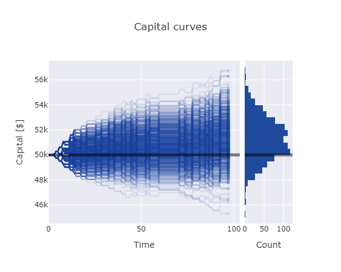
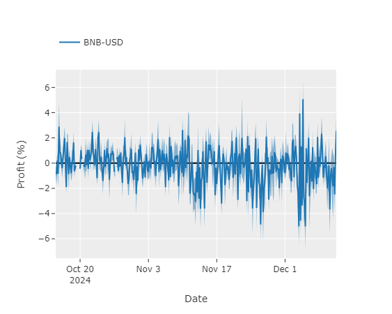
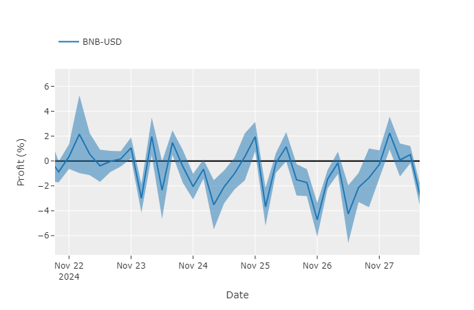
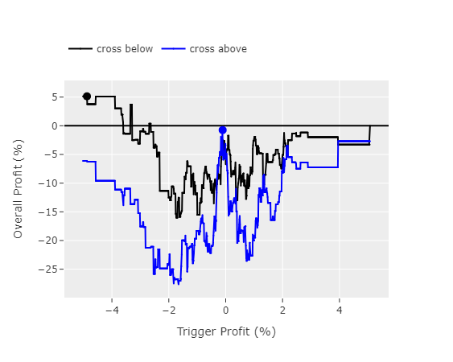

# Random Trading Strategy
The aim of this project is to create a simple trading strategy based on random entries. The idea is that if no technical anlaysis and no fundamental analysis is used, the only way to make money is to have a good risk management. Monte Carlo simulations will be used to test the strategy.

<!-- table of contents -->
## Table of Contents
- [Random entries](#random-entries)
- [Risk management](#risk-management)
- [Results](#results)

# Random entries
Entries are made purely randomly. The first trade is 50% long and 50% short. After the first trade is exited, the following positions are opened with a predefined probability based on the last trade. For instance if the last trade was a winner, the probability of going the same direction for the next trade is higher (or maybe lower based on the user discretion). Let's say the probability of going the same direction after a winner is 75%. It means that the next trade will be 75% the same direction as the last trade and 25% the opposite direction given that the last trade was a winner. If the last trade was a loser, the probability of going the same direction is 25% and the probability of going the opposite direction is 75%.

There are options to use indicators to filter the trades. For instance, the strategy can use ADX to filter the trades. If the ADX is above (or below) a certain level, the trade will be taken. 

# Risk management
The risk management is key in this strategy. The risk is defined as a percentage of the account balance and it is a user input. This strategy always uses stop losses and take profits. It can incorporate trailing SL as well. The reward-to-risk ratio is also a user input. The strategy will exit the trade if the stop loss or take profit is hit. If the last trade never hit the stop loss or take profit, it will not be counted in the results.

# Results
The results are based on Monte Carlo simulations. The results are based on the assumption that slippage and spread are zero. 

The capital curve for the strategy is shown below. The results shown below is for BNB-USD, time frame 5m, total simulation time 8 hours, and a total of 5000 simulations. The purpose is not to show the profitability of the strategy but to make this project reproducible. 

In this example the peak of the capital curve histogram is higher than the initial capital. This means that the strategy was profitable.

It should be noted that the mode (peak of the histogram) changes a lot based on the simulations parameters and the time window of the simulation. This is the point where most of the simulations were ended. The mode is the most likely outcome of the strategy. For example, in the image above, the mode is ~$51k, meaning the most probable capital after the simulation time window is ~$1k profit. But before the time window started, we did not know that the mode would be ~$51k. Therefore, the next idea would be to use a more sophisticated method to estimate the behavior of the mode over time.

Let's say all the simulation parameters are kept the same but the time window is marching forward. Naturally the mode of the histogram will change over time. The idea is to understand the behavior of the peak of the histogram over time. The graph of the mode over time is below:

This graph shows the mode of the 4h time windows marching forward for almost two months. As can be seen, the mode is not stable and changes a lot. In the graph the mode is shown alongside with the one standard deviation of the mode. A close look at the graph is shown below:

The next step would be to understand the behavior of the mode. Here I used the most simple method to estimate the next mode. For this, I used crossover of the mode with different profit levels. The idea is that if the mode crosses (above or below) a certain profit level in a given time window, the strategy will be activated at that time for the next time window. It definitely is not the best method but it is a start. The graph of overall profit vs trigger profit level is shown below:

This graph shows that if the mode crosses below the trigger level of -5%, the overall profit will be maximized and will be ~5% for the entire simulation time. However, this project is far from being finished and there are many things to be done. 

# Next steps
- Use more sophisticated methods to estimate the behavior of the mode over time
- Use more sophisticated methods to estimate the trigger level
- Use more robust backtesting packages already available in python ([pyfolio](https://github.com/quantopian/pyfolio), [vectorbt](https://vectorbt.dev/), [backtesting.py](https://kernc.github.io/backtesting.py/), etc.). As of now, the backtesting is done manually and it is not efficient. 
- One huge improvement would be to use parallel processing since the Monte Carlo simulations are independent of each other. For instance, I used 5000 for a given time window and they are entirely independent of each other. For this reason, consider using [multiprocessing](https://docs.python.org/3/library/multiprocessing.html) package.
- The documentation is not complete and the I am not happy with the structure of the code either. A more object oriented approach would be better.
- This exact strategy is also written in MQL5 and would be nice to add it here as well. The MQL5 backtesting is more robust and it would be nice to compare the results. But the results are not easily convertible to be used in python.